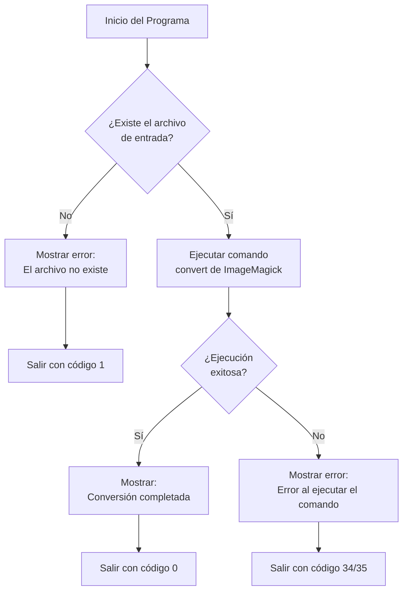

# Conversor de Imágenes

## Descripción
Este proyecto es un programa Java que convierte imágenes de un formato a otro utilizando el comando `convert` de ImageMagick. El programa verifica la existencia del archivo de entrada y ejecuta el comando de conversión correspondiente.
> https://github.com/liuDam1/ejercicioImagenes.git

## Requisitos
- **Java 17** o superior
- **ImageMagick** instalado en el sistema
  - En sistemas Linux:
    ```bash
    sudo apt-get install imagemagick
    ```
  - En Windows: Descargar e instalar desde [el sitio oficial de ImageMagick](https://imagemagick.org/script/download.php)
- **Maven** para compilar y ejecutar el proyecto

## Estructura del Proyecto
```
ejercicioImagenes/
├── src/
│   ├── main/
│   │   ├── java/
│   │   │   └── es/etg/es/imagen/
│   │   │       └── Main.java  # Código fuente principal
│   │   └── resources/         # Directorio para archivos de recursos
│   └── test/
├── pom.xml                    # Configuración de Maven
└── README.md                  # Este archivo
```

## Explicación del Programa

El programa es un conversor de imágenes que utiliza el comando `convert` de ImageMagick para cambiar el formato de una imagen de origen a un formato de destino. Actualmente, el código está configurado para convertir archivos fijos:

- Archivo de entrada fijo: `src/main/resources/dados.png`
- Archivo de salida fijo: `src/main/resources/dados.jpg`

El funcionamiento es el siguiente:
1. Verifica si existe el archivo de entrada especificado
2. Si no existe, muestra un mensaje de error y sale con código 1
3. Si existe, ejecuta el comando `convert` de ImageMagick para realizar la conversión
4. Si el comando se ejecuta correctamente, finaliza con código 0
5. Si ocurre algún error durante la ejecución, muestra un mensaje de error y sale con códigos de error 34 o 35

## Flujo del Programa



## Uso

### Compilación
Para compilar el proyecto con Maven, ejecuta:
```bash
mvn clean compile
```

### Ejecución
Actualmente, el programa está configurado para convertir archivos fijos:
- Entrada: `src/main/resources/dados.png`
- Salida: `src/main/resources/dados.jpg`

Para ejecutar el programa:
```bash
mvn exec:java -Dexec.mainClass="es.etg.es.imagen.Main"
```

## Mejoras Potenciales
- **Personalización de parámetros**: Modificar el código para aceptar parámetros por línea de comandos en lugar de archivos fijos, como se menciona en el enunciado:
  ```
  java Programa monalisa.jpg monalisa.png
  ```
- **Soporte para más formatos**: Ampliar la verificación de formatos soportados
- **Manejo de errores más detallado**: Mejorar los mensajes de error para proporcionar más información
- **Validación de extensiones**: Verificar que las extensiones de los archivos sean compatibles

## Notas Importantes
- Asegúrate de que el comando `convert` esté disponible en el PATH del sistema
- El archivo de entrada debe existir en la ubicación especificada
- Los directorios para los archivos de salida deben existir
- El programa requiere permisos de ejecución para los comandos del sistema

